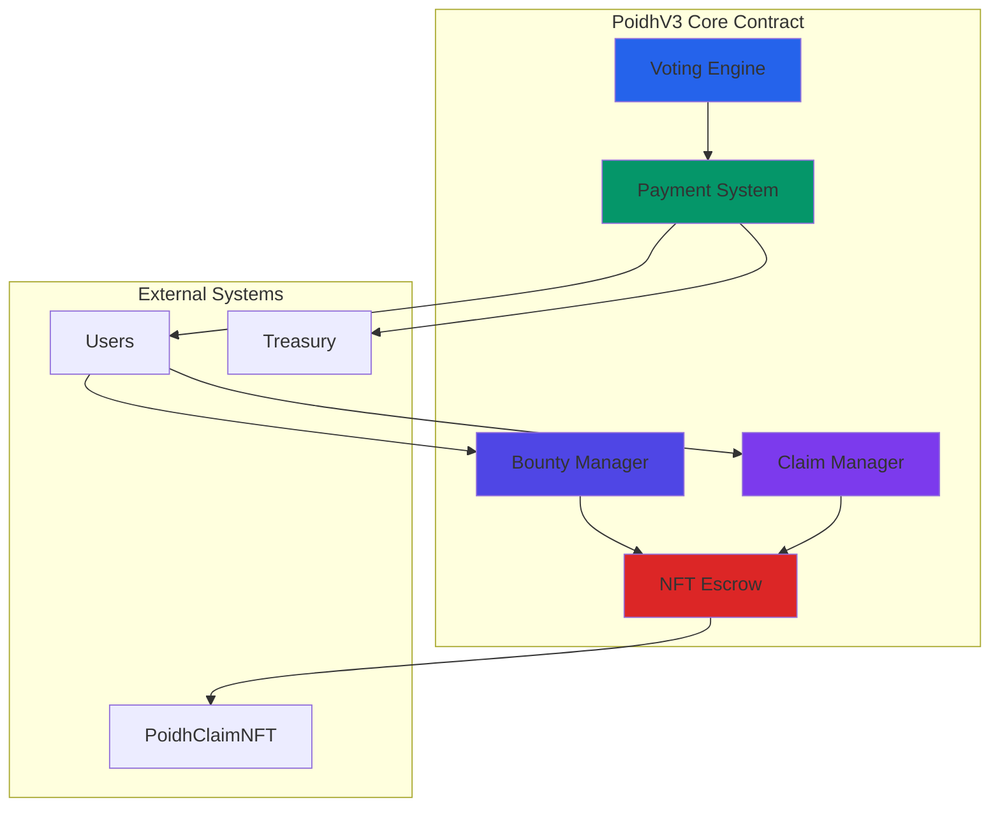
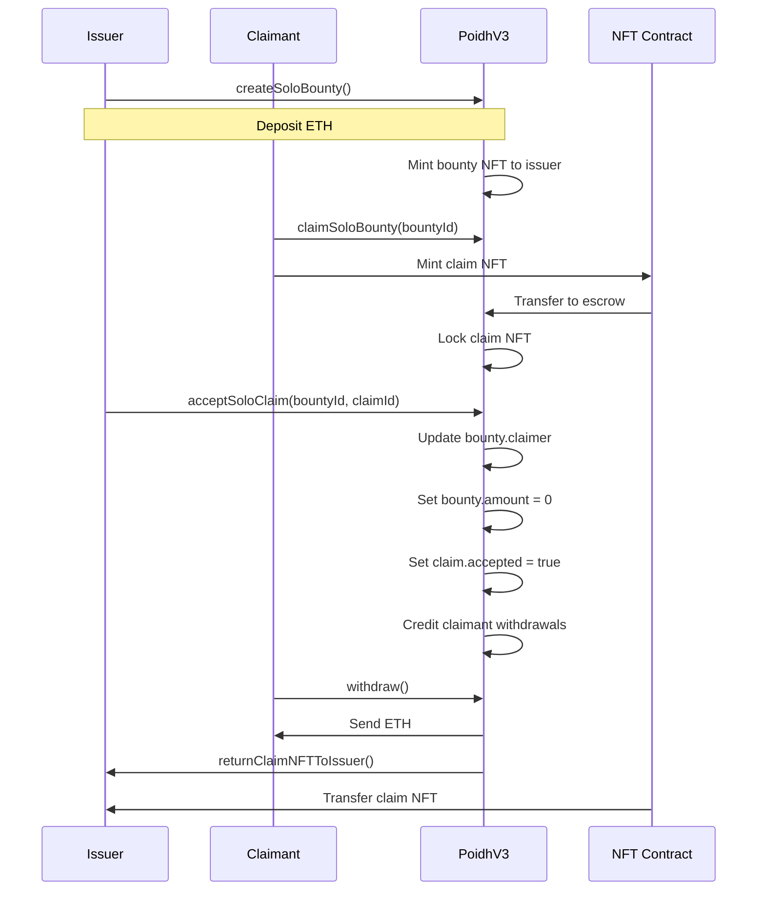
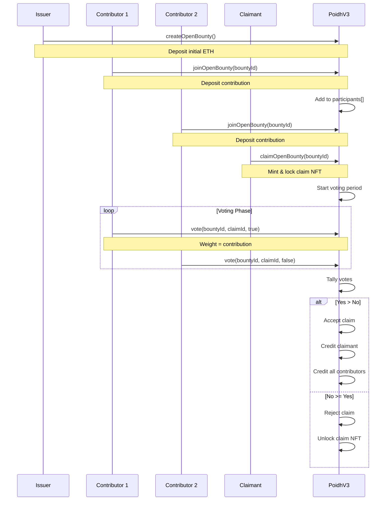

# Architecture

## System Overview

POIDH v3 is a smart contract system that manages bounty creation, funding, claiming, and resolution through two primary bounty types: **solo** and **open**.

## Core Components



## Data Structures

### Bounty

```solidity
struct Bounty {
    uint256 id;              // Unique identifier
    address issuer;          // Creator address
    string name;             // Bounty name
    string description;      // Details
    uint256 amount;          // Total funding (wei)
    address claimer;         // 0=active, issuer=cancelled, other=accepted
    uint256 createdAt;       // Timestamp
    uint256 claimId;         // Accepted claim ID
}
```

### Claim

```solidity
struct Claim {
    uint256 id;              // Unique identifier
    address issuer;          // Claimant address
    uint256 bountyId;        // Associated bounty
    address bountyIssuer;    // Bounty creator
    string name;             // Claim name
    string description;      // Details
    uint256 createdAt;       // Timestamp
    bool accepted;           // Acceptance status
}
```

### Votes

```solidity
struct Votes {
    uint256 yes;             // Total YES votes (weighted)
    uint256 no;              // Total NO votes (weighted)
    uint256 deadline;        // Voting end timestamp
}
```

## System Flows

### Solo Bounty Flow



### Open Bounty Flow



## Key Design Patterns

### 1. Checks-Effects-Interactions (CEI)

All external functions follow strict CEI ordering:

```solidity
function example() external nonReentrant {
    // 1. CHECKS
    require(condition, "error");
    
    // 2. EFFECTS
    stateVariable = newValue;
    emit Event();
    
    // 3. INTERACTIONS
    externalCall();
}
```

### 2. Pull Payments

No direct ETH transfers to users:

```solidity
// Instead of:
payable(recipient).transfer(amount);

// We use:
pendingWithdrawals[recipient] += amount;
// User calls withdraw() later
```

### 3. NFT Escrow

Claim NFTs are held in-contract:

```solidity
// Mint directly to contract
poidhNft.mint(address(this), ...);

// Transfer without callback
poidhNft.transferFrom(address(this), recipient, tokenId);
```

## Storage Layout

```
┌─────────────────────────────────────────────┐
│         State Variables                     │
├─────────────────────────────────────────────┤
│ Bounty[] bounties                           │
│ Claim[] claims                              │
│ uint256 bountyCounter                       │
│ uint256 claimCounter                        │
├─────────────────────────────────────────────┤
│         Mappings                            │
├─────────────────────────────────────────────┤
│ userBounties[address] → bountyIds[]         │
│ userClaims[address] → claimIds[]            │
│ bountyClaims[bountyId] → claimIds[]         │
│ participants[bountyId] → addresses[]        │
│ participantAmounts[bountyId] → amounts[]    │
│ pendingWithdrawals[address] → amount        │
│ votes[bountyId][claimId] → Votes           │
└─────────────────────────────────────────────┘
```

## Gas Optimization

- **Counter caching**: `bountyCounter` and `claimCounter` prevent array length lookups
- **Slot reuse**: Free participant slots are reused via stack
- **Batch operations**: Multiple contributions in single transaction
- **Event emission**: Minimal events for gas efficiency
