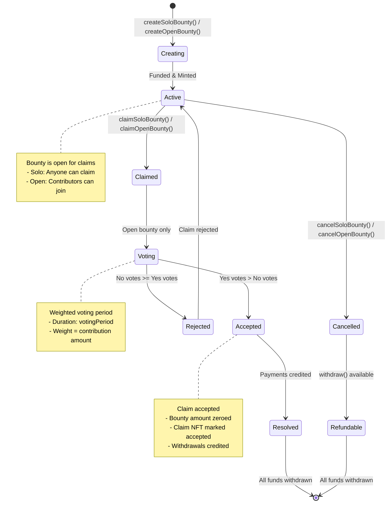
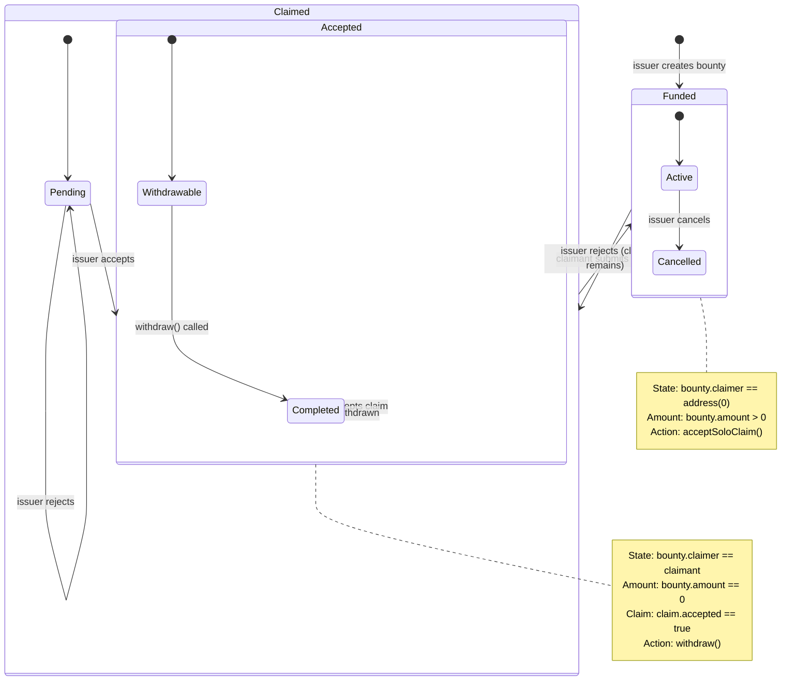
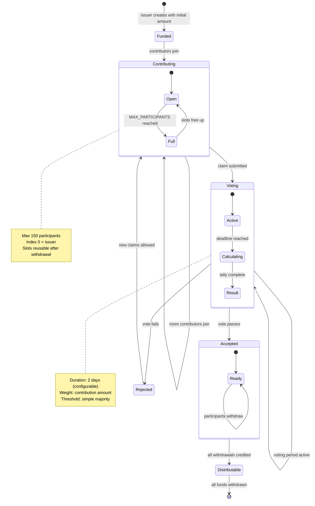
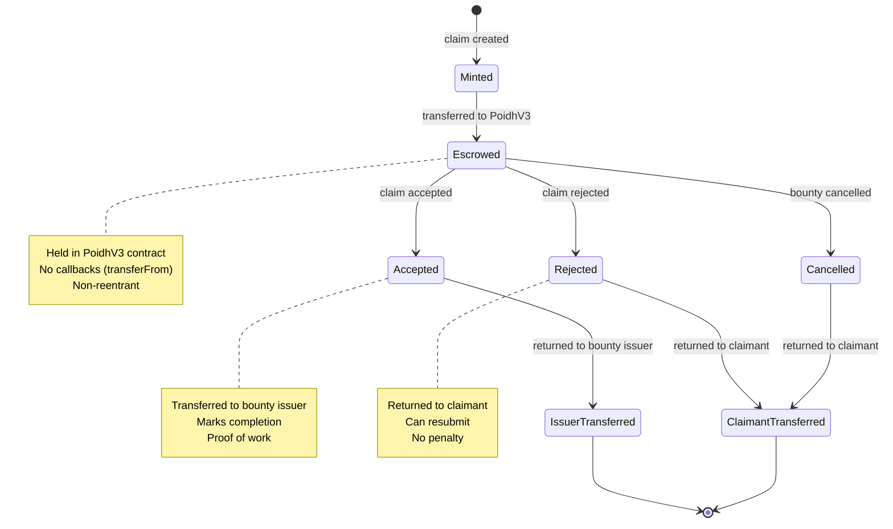
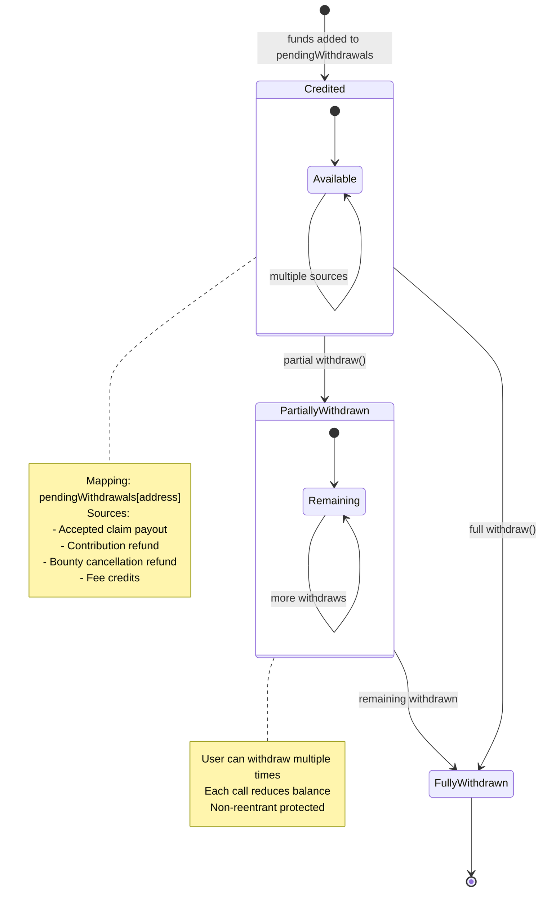
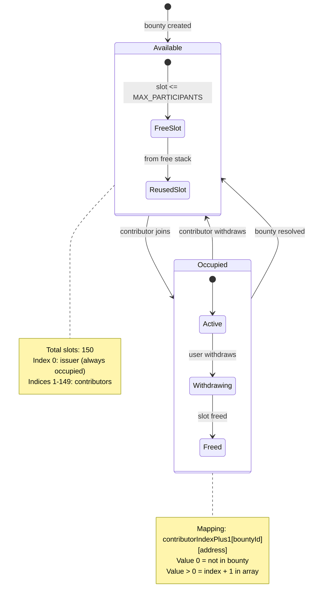
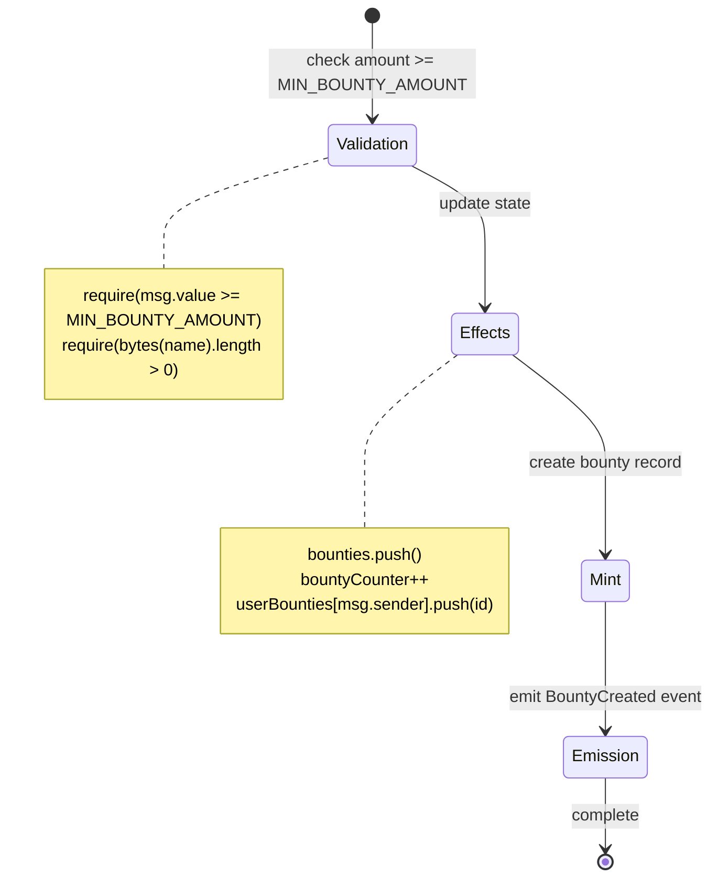
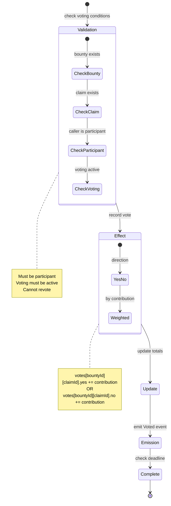
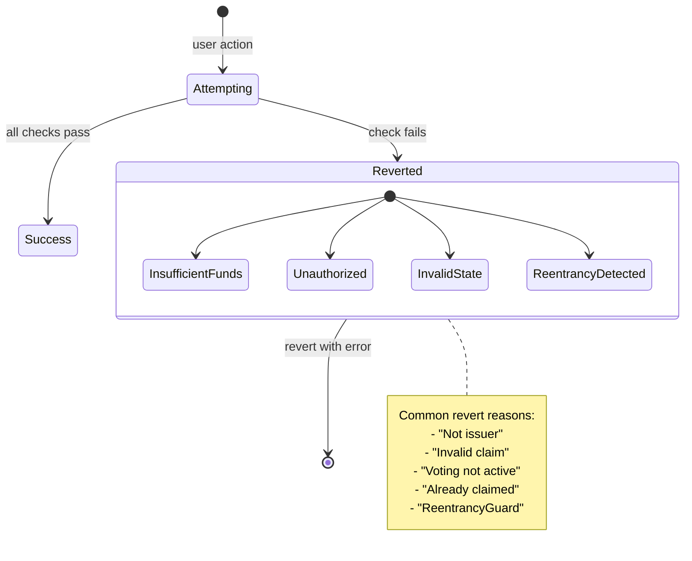

# State Machines

## Bounty Lifecycle States

## Solo Bounty State Machine

## Open Bounty State Machine

## Claim NFT State Machine

## Withdrawal State Machine

## Participant Slot State Machine

## Transaction Flow States

### Create Solo Bounty

### Vote on Open Bounty Claim

## Error State Transitions

